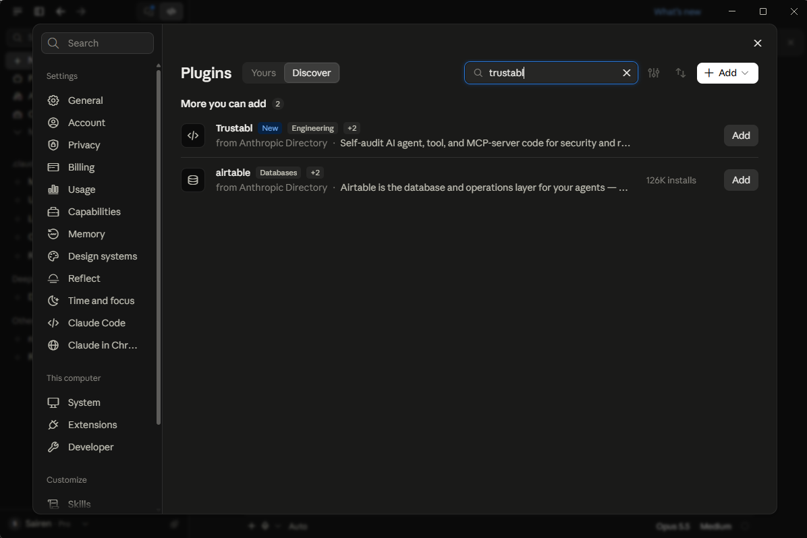
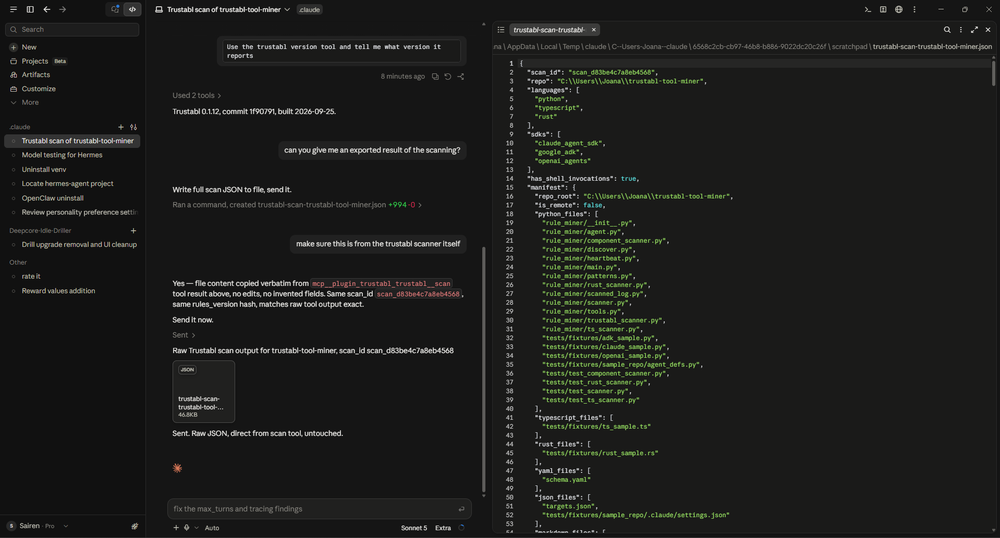

# Trustabl in Claude

The Trustabl plugin brings the scanner into Claude Code and Cowork. Claude can
scan a repository during a conversation, read the findings, and apply the fixes
each one suggests.

It ships no binary. On first use it downloads the pinned scanner for your
platform, verifies it against the release's `checksums.txt`, and caches it.
Nothing is executed before the checksum matches.

## Install

1. Open Claude, go to **Settings**, then **Plugins**
2. Select **Discover** and search for `trustabl`
3. Select **Add**



That is the whole setup. You do not need to install the CLI first.

> **Looking for it on the web?** The claude.ai directory surfaces connectors
> rather than plugins, so searching there returns nothing unless you already
> have the plugin installed. Use **Settings → Plugins → Discover** inside the
> app instead.

If you would rather add it from the marketplace directly, in Claude Code:

```
/plugin marketplace add trustabl/claude-plugin
```

## What you get

| | |
|---|---|
| `/trustabl:scan` | Scan on demand and report, changing nothing |
| `/trustabl:fix` | Scan, then apply the fixes the findings call for |
| `trustabl-scan` skill | Claude offers a scan after you write or edit agent code |
| `trustabl-enrich` skill | Applies findings to source files |
| `trustabl` subagent | Runs the whole scan, review and apply loop |
| `scan` tool | Lets Claude scan a repository mid-conversation |

## Use it

Point Claude at a local folder or a GitHub URL. A URL is cloned to a temporary
directory and removed when the scan exits.

```
Scan this repo with Trustabl
Scan https://github.com/owner/repo with Trustabl and summarise the worst issues
```



Read the inventory before the findings. If the tool and agent counts look
wrong, the scan was pointed at the wrong directory and the findings are not
worth acting on yet. An empty result is not a pass either — a repository with
no recognised agent surfaces produces no findings.

## Fixing what it finds

`/trustabl:fix` runs the scan, checks the inventory, then applies fixes through
the `trustabl-enrich` skill, which is driven by each finding's own explanation
and suggested fix. It shows the diff before writing and leaves anything needing
a judgement about your system, such as which hosts a tool should be allowed to
reach.

A re-scan afterwards tells you the finding is gone. It does not tell you the
code is right, so review the diff.

## Where it works

Claude Code and Cowork. The scanner runs on your own machine, so it does not
run inside the claude.ai web app. The skills still load there, but for a real
scan use Claude Code.

## Privacy

Scanning runs entirely on your machine. There is no hosted scanner, no account,
no code upload, and no model in the analysis path — the analysis is
deterministic. The only network calls are fetching the scanner on first use and
the versioned rule pack at scan time. Telemetry is opt in and off by default.

## Links

- [Plugin source](https://github.com/trustabl/claude-plugin)
- [Scanner and rule packs](https://github.com/trustabl/agent-reliability-analyzer)
- [Ecosystem integrations](integrations.md)
- [Report an issue](https://github.com/trustabl/claude-plugin/issues)
